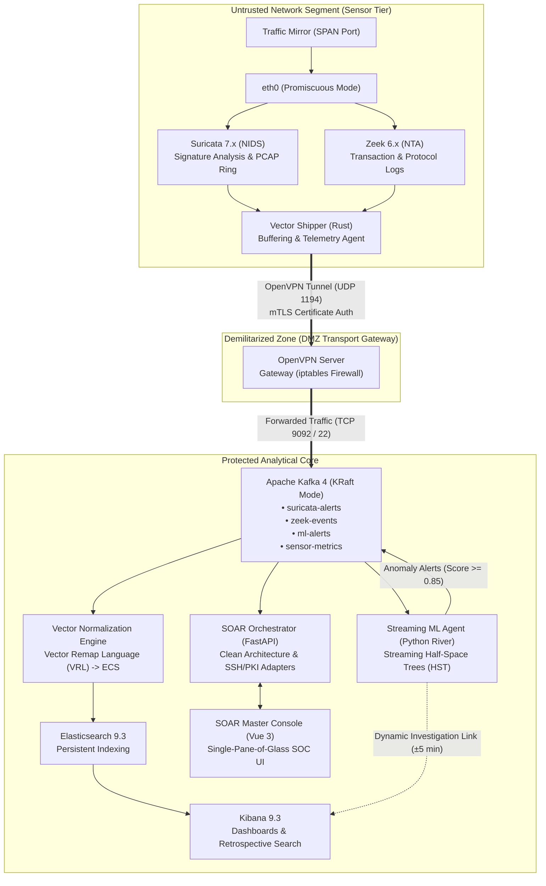

# Multi-Agent SIEM & SOAR System with In-Memory Streaming ML

[](LICENSE)
[](https://fastapi.tiangolo.com)
[](https://vuejs.org/)
[](https://www.docker.com/)
[](https://riverml.xyz/)
[](https://suricata.io/)
[](https://zeek.org/)
[](https://vector.dev/)

> **Next-Generation Distributed Security Information & Event Management (SIEM) and Security Orchestration, Automation, and Response (SOAR) platform** featuring edge traffic preprocessing, zero-trust cryptographic isolation, and in-memory streaming machine learning anomaly detection.

[Русская версия (Russian Version)](README_RU.md)

---

## 📑 Table of Contents
- [Executive Overview](#-executive-overview)
- [Architectural Topology](#-architectural-topology)
- [System Components & Agents](#-system-components--agents)
- [In-Memory Streaming ML Engine](#-in-memory-streaming-ml-engine)
- [Queuing Theory Modeling & Evaluation](#-queuing-theory-modeling--evaluation)
- [SOAR Master Console Capabilities](#-soar-master-console-capabilities)
- [Standalone Demo Mode](#-standalone-demo-mode)
- [Quickstart Guide](#-quickstart-guide)
- [Visual Assets & Screenshots](#-visual-assets--screenshots)
- [Project Structure](#-project-structure)
- [License & Credits](#-license--credits)

---

## 🎯 Executive Overview

Conventional monolithic SIEM systems face severe performance degradation during massive cyber attacks and high-volume network conditions. Forwarding gigabytes of raw, unstructured network packets directly to a centralized core causes **hardware queue overflow**, **bottlenecks at syntax parsers**, and **prolonged indexing delays** before security analysts receive critical incident alerts.

This project implements a **Distributed Multi-Agent Architecture** that solves these limitations:
1. **Edge Preprocessing & Filtering:** Eliminates information noise at the perimeter using lightweight agents (**Suricata NIDS**, **Zeek NTA**, and **Vector** in Rust). Only compact, enriched metadata is transferred across the network.
2. **Pre-Storage In-Memory ML Detection:** Integrates an unsupervised streaming anomaly detector (**Streaming Half-Space Trees**) directly into the Kafka message broker critical path. Anomaly scoring occurs in RAM **prior** to disk persistence and Elasticsearch indexing.
3. **Automated Incident Response (SOAR):** Provides a centralized console built on **FastAPI** (Clean/Onion Architecture) and **Vue 3** (Tailwind CSS, dark mode, i18n) for dynamic IDS rule orchestration, remote Git synchronization, automated PKI VPN certificate lifecycle management, and on-demand PCAP retrieval.
4. **Empirically Proven Latency Reduction:** Theoretical Queuing Theory modeling ($M/M/1/\infty/FIFO$) and empirical evaluation on the benchmark **CICIDS-2017** dataset confirm an **operational speedup coefficient \(K_{op} = 2.05\)** (\(>2\times\) reduction in alert latency under high loads).

---

## 🏛 Architectural Topology

The platform enforces a strict three-tier zonal separation model guaranteeing zero-trust isolation between edge sensors and the analytical core:



<p align="center">
  
  <br/>
  <em>Figure 1 — Multi-Agent System Architecture & Security Zone Segregation</em>
</p>

### Network Zones & Security Boundaries

| Zone | Trust Level | Components | Allowed Inbound Protocols |
|---|---|---|---|
| **Untrusted Perimeter** | Low | SPAN tap, Suricata, Zeek, Vector Agent | None (Passive capture interface) |
| **DMZ Gateway** | Medium | OpenVPN Server, iptables firewall | `UDP 1194` (Encrypted VPN Tunnel only) |
| **Protected Core** | High | Apache Kafka, Vector VRL, ML Engine, Elasticsearch, Kibana, SOAR Console | Strictly internal (`TCP 9092, 9200, 5601, 8000, 80`) |

---

## ⚙️ System Components & Agents

### 1. Perimeter Sensors (Edge Layer)
- **Suricata 7.x (NIDS):** Inspects mirrored frames via `af-packet` against signature sets (e.g. Emerging Threats). Automatically writes raw trigger alerts to `eve.json` while maintaining cyclical PCAP captures on local disk for deep packet forensics.
- **Zeek 6.x (Network Traffic Analyzer):** Performs stateful protocol parsing and connection metadata extraction (`conn.log`, `dns.log`, `http.log`, `ssl.log`). Outputs structured JSON records.
- **Vector (Rust Shipper Agent):** Replaces legacy resource-heavy agents (e.g., Logstash). Memory footprint stays under **25 MB RAM**. Features native memory and disk-backed buffering, sends host telemetry (CPU %, RAM %), and ships records over mTLS VPN.

### 2. Transport Gateway (DMZ)
- **OpenVPN 2.6 Server:** Provides authenticated tunneling between remote sensors and the central core.
- **Automated PKI Management:** Built-in certificate issuance, serial tracking, revocation, and automated Certificate Revocation List (CRL) distribution via SSH/SCP.
- **iptables Isolation:** Sensors can only send packets to designated Kafka ports (`9092`) and accept administrative SSH (`22`). Sensor nodes have zero direct network route to databases or web interfaces.

### 3. Central Core & Orchestration
- **Apache Kafka 4 (KRaft Mode):** Distributed message broker operating without ZooKeeper dependencies. Provides decoupled, high-throughput buffers preventing message loss during peak traffic bursts.
- **Vector ECS Normalizer:** Transforms incoming multi-source logs into **Elastic Common Schema (ECS)** format using **Vector Remap Language (VRL)**. Normalizes timestamps, IP mappings, port numbers, and enriches records with GeoIP data.
- **Elasticsearch & Kibana 9.3:** Distributed persistent indexer and forensic discovery workspace.
- **SOAR Master Console (FastAPI + Vue 3):** Administrative single-pane-of-glass platform providing sensor heartbeat tracking, live ML anomaly feed, one-click Suricata rule deployment, Git repository rule synchronization, and PCAP download.

---

## 🧠 In-Memory Streaming ML Engine

Traditional batch machine learning requires accumulating massive historical datasets, causing high computational overhead and preventing real-time anomaly detection. 

This platform deploys the **Streaming Half-Space Trees (HST)** algorithm (Tan et al., IJCAI) via the Python **River** streaming ML library.

```
Incoming Stream (Kafka) ──► Feature Extraction ──► Half-Space Trees Scoring ──► Threshold Check (>=0.85)
                                                           │                              │
                                                           ▼ (Learn)                      ▼
                                                   Incremental Update             Emit Anomaly Alert
```

### Key Mathematical Characteristics
- **Computational Complexity:** Amortized **\(O(1)\)** constant time per event observation.
- **Memory Footprint:** Constant bounded memory relative to stream length:
  $$\text{Memory} \sim O(t \cdot 2^h)$$
  where \(t\) is tree count and \(h\) is max tree depth.
- **Feature Vector ($d$-dimensional):**
  - Session duration (`duration`)
  - Transmitted & received packets (`orig_pkts`, `resp_pkts`)
  - Volume in bytes (`orig_bytes`, `resp_bytes`)
  - Derived asymmetry ratio: $\text{ratio\_bytes} = \frac{\text{orig\_bytes} + 1}{\text{resp\_bytes} + 1}$
  - Average packet size: $\text{avg\_pkt\_size} = \frac{\text{bytes}}{\text{packets}}$
- **Hyperparameter Configuration:**
  - Number of trees: $t = 25$
  - Maximum tree height: $h = 15$
  - Sliding reference window: $\psi = 250$
  - Anomaly decision threshold: $\theta = 0.85$

---

## 📊 Queuing Theory Modeling & Evaluation

To mathematically prove the operational timeliness advantage of the multi-agent streaming architecture over a centralized monolithic SIEM, analytical models based on Queuing Theory (\(M/M/1/\infty/FIFO\)) were formulated and validated.

### 1. Mathematical Formulations

- **Centralized Architecture Latency Model:**
  $$T_{\text{centr}}(\lambda) = t_{tr}^{raw} + \frac{1}{\mu_{\text{centr}} - \lambda} = 0.011 + \frac{1}{160 - \lambda}$$
  *(where \(t_{tr}^{raw} = 11\text{ ms}\) is raw packet transfer overhead, \(\mu_{\text{centr}} = 160\text{ events/s}\) is central core processing capacity).*

- **Multi-Agent Streaming Latency Model:**
  $$T_{\text{MAS}}(\lambda) = t_{\text{edge}} + t_{tr}^{\text{meta}} + t_{\text{bus}} + \frac{1}{\mu_{\text{ML}} - \lambda} = 0.007 + \frac{1}{250 - \lambda}$$
  *(where edge preprocessing, metadata transit, and bus delay total \(7\text{ ms}\), and \(\mu_{\text{ML}} = 250\text{ events/s}\)).*

- **Operational Timeliness Coefficient:**
  $$K_{\text{op}}(\lambda) = \frac{T_{\text{centr}}(\lambda)}{T_{\text{MAS}}(\lambda)}$$

### 2. Theoretical vs. Experimental Results

| Ingress Load \(\lambda\) (events/s) | Monolithic Latency \(T_{\text{centr}}\) (ms) | Multi-Agent Latency \(T_{\text{MAS}}\) (ms) | Speedup Ratio \(K_{\text{op}}\) |
|---|---|---|---|
| 20 | 18.14 ms | 11.35 ms | **1.60x** |
| 60 | 21.00 ms | 12.26 ms | **1.71x** |
| 100 | 27.67 ms | 13.67 ms | **2.02x** |
| 140 (Peak load) | 61.00 ms | 16.09 ms | **3.79x** |
| **Theoretical Mean** | **29.52 ms** | **13.24 ms** | **2.23x** |
| **Experimental Mean (CICIDS-2017)** | **25.58 ms** | **12.47 ms** | **2.05x** |

<p align="center">
  
  <br/>
  <em>Figure 2 — Processing Delay vs Event Rate: Monolithic Centralized SIEM vs Multi-Agent Architecture</em>
</p>

> **Statistical Significance:** Verified using two-sample Student's t-test on 10 independent test runs (\(t_{\text{obs}} = 4.63 > t_{\text{crit}} = 1.83, p < 0.05\)). Under peak loads, the multi-agent streaming pipeline demonstrates nearly **4x lower processing delay** while maintaining equivalent detection accuracy.

---

## 🖥 SOAR Master Console Capabilities

The SOAR management plane provides a responsive, single-pane-of-glass interface built with modern UX principles:

<p align="center">
  
  <br/>
  <em>Figure 3 — SOAR Master Console: ML Engine Status & Live Anomaly Alert Feed</em>
</p>

1. **Live Infrastructure & ML Anomaly Dashboard:**
   - Real-time engine health status and dynamic toggle controls (Start/Stop ML Agent).
   - Live stream of detected network anomalies with severity tags (Critical, High), source IP, sensor origin, and anomaly score.
   - **One-Click Dynamic Kibana Deep-Linking:** Automatically constructs a pre-filtered Kibana Discover link centered around the exact incident timestamp (\(\pm 5\text{ minutes}\)) with Lucene/KQL query formatting (`source.ip:"x.x.x.x"`).
2. **Sensors Inventory & Telemetry Monitoring:**
   - Real-time online/offline heartbeat detection based on timestamp tracking.
   - Live CPU and RAM utilization metrics per sensor node.
   - CRUD management for registering edge sensor instances.
3. **Suricata Rules Orchestration & Git Sync:**
   - Live viewer of active custom rules across sensors.
   - Batch rule syntax injection with automated `suricatasc -c reload-rules` signaling without sensor daemon restarts.
   - **Remote Git Source Synchronization:** Connects to external Git repositories (e.g. Emerging Threats rulesets) to automatically pull, filter duplicates, and deploy signatures to edge sensors.
4. **Traffic Capture (PCAP) Retrieval:**
   - Inspect remote rolling capture files stored in `/var/log/pcap/` on perimeter sensors.
   - Secure SFTP download for offline Wireshark and Network Forensics analysis.
5. **VPN & PKI Certificate Management:**
   - Automated client certificate generation (2048-bit keys, client configuration packaging into `.ovpn` files).
   - One-click certificate revocation and CRL synchronization.
6. **Modern Interface & Localization:**
   - Dark and light theme toggle.
   - Full bilingual support (English & Russian).

---

## 🚀 Standalone Demo Mode

To allow complete exploration in public portfolios without requiring external virtual machines, Kafka clusters, or remote SSH agents, the system includes a comprehensive **Standalone Demo Mode** (`DEMO_MODE=True`).

When `DEMO_MODE=True` (active by default in `.env.example`):
- **Mock SSH Client:** Emulates remote command execution, telemetry retrieval, Suricata rule deployment, and synthesizes **valid binary libpcap capture files** for download.
- **Mock Kafka & Anomaly Generator:** Simulates dynamic telemetry heartbeats (CPU, RAM) and generates realistic Half-Space Trees anomaly alerts in Elastic Common Schema format.
- **Mock PKI Manager:** Provides in-memory certificate lifecycle operations (issuance, revocation, `.ovpn` profile generation).
- **Auto-Seeded Enterprise Database:** Seeds neutral enterprise sensors (`Sensor-Alpha`, `Sensor-Beta`, `Sensor-Gamma`) and threat intelligence rule sources.

---

## 📦 Quickstart Guide

### Prerequisites
- [Docker](https://docs.docker.com/get-docker/) & [Docker Compose](https://docs.docker.com/compose/) (Recommended)
- Or **Python 3.11+** & **Node.js 20+** for local development.

### Option 1: Docker Compose (One-Command Launch)

1. Clone the repository:
   ```bash
   git clone https://github.com/KrayMakso68/edge-routed-siem.git
   cd edge-routed-siem
   ```

2. Copy the environment configuration:
   ```bash
   cp .env.example .env
   ```

3. Build and launch all services:
   ```bash
   docker compose up --build -d
   ```

4. Open your browser:
   - **SOAR Web Console:** [http://localhost](http://localhost) (or [http://localhost:5173](http://localhost:5173))
   - **Backend API & Swagger Docs:** [http://localhost:8000/docs](http://localhost:8000/docs)
   - **Healthcheck:** [http://localhost:8000/health](http://localhost:8000/health)

---

### Option 2: Local Development Setup

#### Backend (FastAPI)
```bash
cd soar_backend
python -m venv .venv

# On Linux/macOS:
source .venv/bin/activate
# On Windows:
.venv\Scripts\activate

pip install -r requirements.txt
cp .env.example .env

# Run FastAPI backend with Uvicorn
uvicorn app.main:app --host 0.0.0.0 --port 8000 --reload
```

#### Frontend (Vue 3 + Vite)
```bash
cd soar_frontend
npm install

# Start Vite development server with proxy to backend
npm run dev
```
Navigate to [http://localhost:5173](http://localhost:5173).

---

## 🖼 Visual Assets & Screenshots

### 1. Sensor Inventory & Live Node Telemetry
<p align="center">
  
</p>

### 2. Suricata IDS Rules Orchestration & Git Sync
<p align="center">
  
</p>

### 3. OpenVPN PKI & Certificate Management
<p align="center">
  
</p>

### 4. Remote PCAP Traffic Capture Forensics
<p align="center">
  
</p>

### 5. Dynamic Retrospective Investigation in Kibana
<p align="center">
  
</p>

---

## 📂 Project Structure

```
astra_soar/
├── docker-compose.yml             # Root Docker Compose deployment
├── .env.example                   # Global environment template
├── .gitignore                     # Git ignore rules
├── README.md                      # English documentation
├── README_RU.md                   # Russian documentation
├── docs/
│   └── images/                    # UI screenshots & architectural diagrams
├── soar_backend/
│   ├── Dockerfile                 # Backend container definition
│   ├── requirements.txt           # Python dependencies
│   ├── .env.example               # Backend environment defaults
│   └── app/
│       ├── main.py                # FastAPI entrypoint & router mounts
│       ├── core/
│       │   ├── config.py          # Pydantic Settings & DEMO_MODE toggle
│       │   ├── telemetry.py       # Telemetry consumer & mock heartbeat
│       │   └── alerts_consumer.py # Anomaly alerts consumer & mock generator
│       ├── api/
│       │   ├── dependencies.py    # Service dependency injection
│       │   └── routers/           # Sensors, Rules, PCAP, ML, VPN endpoints
│       ├── domain/
│       │   └── schemas.py         # Pydantic request/response schemas
│       ├── infrastructure/
│       │   ├── database.py        # SQLite database & enterprise seed data
│       │   ├── mock_services.py   # Mock SSH, PKI, ML state, and binary PCAP
│       │   ├── ssh_client.py      # Paramiko adapter with mock delegation
│       │   └── systemd.py         # Systemd process manager
│       ├── services/              # Business logic (Sensor, Rule, ML, PCAP)
│       └── workers/
│           └── ml_agent.py        # River Streaming Half-Space Trees worker
└── soar_frontend/
    ├── Dockerfile                 # Multi-stage Vue build & Nginx runtime
    ├── nginx.conf                 # Nginx reverse proxy configuration
    ├── package.json               # Vue 3, Tailwind, Vite dependencies
    ├── vite.config.js             # Vite configuration with /api proxy
    └── src/
        ├── api.js                 # Centralized Axios API client
        ├── i18n.js                # English & Russian localization
        ├── App.vue                # Main shell, sidebar, and theme switcher
        └── views/                 # Dashboard, Sensors, Rules, VPN, PCAP
```

---

## 📄 License & Credits

Developed as an advanced engineering prototype for scalable SOC and corporate network defense operations.

- **Author:** SOC Architecture & Security Engineering Portfolio ([@KrayMakso68](https://github.com/KrayMakso68))
- **Key References:**
  - S.C. Tan, K.M. Ting, T.F. Liu. *Fast Anomaly Detection for Streaming Data*, IJCAI 2011.
  - L. Kleinrock. *Queueing Systems, Volume I: Theory*, 1975.
  - Canadian Institute for Cybersecurity. *CICIDS-2017 Intrusion Detection Benchmark*.
