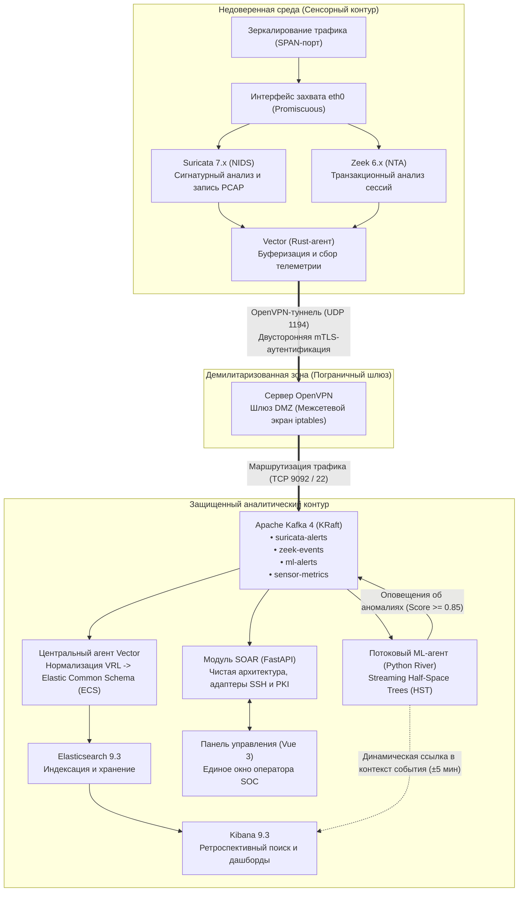
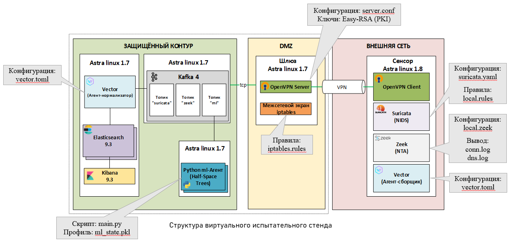
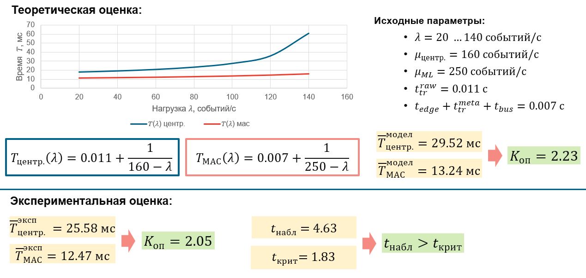
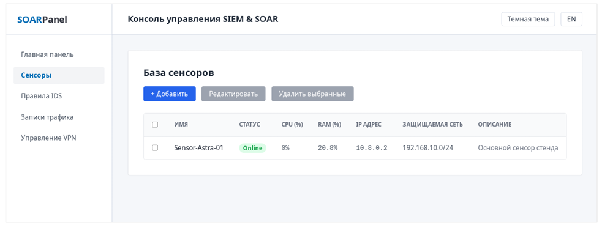
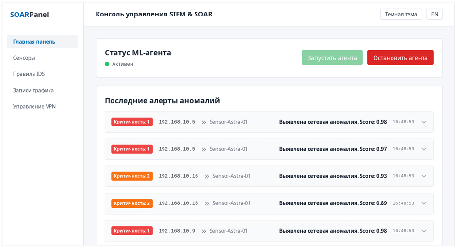
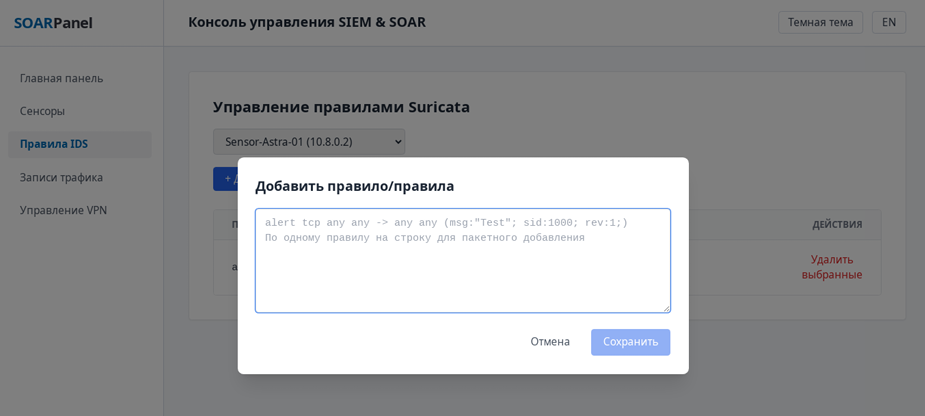
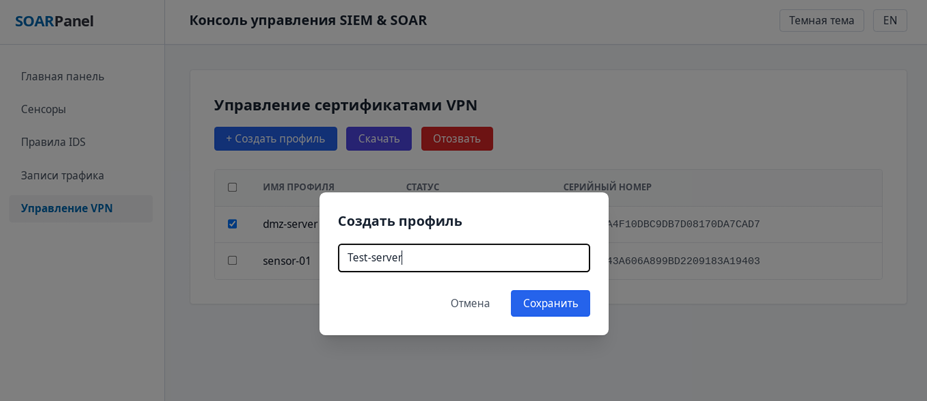
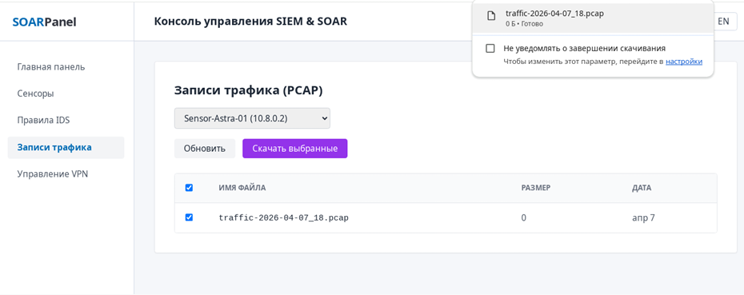
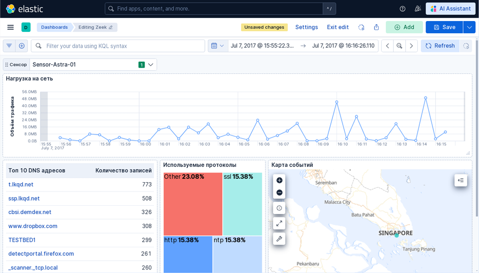

# Мультиагентная система мониторинга и управления событиями информационной безопасности (SIEM & SOAR) с потоковым ML-анализом аномалий в оперативной памяти

[](LICENSE)
[](https://fastapi.tiangolo.com)
[](https://vuejs.org/)
[](https://www.docker.com/)
[](https://riverml.xyz/)
[](https://suricata.io/)
[](https://zeek.org/)
[](https://vector.dev/)

> **Распределенный программно-аппаратный комплекс нового поколения для центров мониторинга информационной безопасности (SOC)**, объединяющий предварительную фильтрацию сетевого трафика на периферии, доверенное криптографическое туннелирование и обнаружение сетевых аномалий в потоке оперативной памяти до сохранения в постоянное хранилище.

[English Version](README.md)

---

## 📑 Содержание
- [Общее описание и актуальность](#-общее-описание-и-актуальность)
- [Архитектурная топология и сетевые зоны](#-архитектурная-топология-и-сетевые-зоны)
- [Компоненты и специализированные агенты](#-компоненты-и-специализированные-агенты)
- [Модуль потокового машинного обучения (Half-Space Trees)](#-модуль-потокового-машинного-обучения-half-space-trees)
- [Математическое моделирование и оценка оперативности (ТМО)](#-математическое-моделирование-и-оценка-оперативности-тмо)
- [Возможности консоли оркестрации и реагирования (SOAR)](#-возможности-консоли-оркестрации-и-реагирования-soar)
- [Автономный демонстрационный режим (DEMO_MODE)](#-автономный-демонстрационный-режим-demo_mode)
- [Руководство по запуску](#-руководство-по-запуску)
- [Галерея интерфейса и скриншоты](#-галерея-интерфейса-и-скриншоты)
- [Структура репозитория](#-структура-репозитория)
- [Лицензия и контакты](#-лицензия-и-контакты)

---

## 🎯 Общее описание и актуальность

Традиционные коммерческие SIEM-системы строятся на монолитной централизованной архитектуре: удаленные сетевые сенсоры пересылают «сырые» нефильтрованные потоки логов на центральный сервер. В условиях интенсивных сетевых атак (DDoS, массированные сканирования) центральное ядро сталкивается с **аппаратным переполнением очередей**, **перегрузкой парсеров** и **длительной задержкой индексации в БД**. В результате операторы дежурных смен SOC получают критические сигналы тревоги со значительным опозданием.

В данном проекте разработана и реализована **распределенная мультиагентная система**, устраняющая «бутылочное горлышко» классических решений:
1. **Периферийная фильтрация и предобработка:** Вычислительная нагрузка по синтаксическому анализу и отсечению информационного шума перенесена непосредственно на сенсорные узлы (**Suricata NIDS**, **Zeek NTA**, **Vector** на языке Rust). В транспортную шину передаются только компактные структурированные метаданные.
2. **Потоковый ML-анализ до долговременного хранения:** Модуль выявления сетевых аномалий (**Streaming Half-Space Trees**) встроен в критический путь конвейера обработки сразу после брокера сообщений Kafka. Анализ осуществляется в оперативной памяти **до** этапа записи на диск и индексации в Elasticsearch.
3. **Автоматизация реагирования и оркестрация (SOAR):** Единый веб-интерфейс на **FastAPI** (Clean Architecture) и **Vue 3** (Tailwind CSS, темная тема, i18n) обеспечивает оперативное управление правилами Suricata, синхронизацию сигнатур из Git-репозиториев, мониторинг телеметрии сенсоров, выгрузку PCAP-дампов и выпуск/отзыв сертификатов VPN.
4. **Доказанное повышение оперативности более чем в 2 раза:** Аналитическое моделирование с применением теории массового обслуживания ($M/M/1/\infty/\text{FIFO}$) и экспериментальные испытания на эталонном датасете **CICIDS-2017** доказали сокращение задержки выявления инцидентов с расчетным коэффициентом оперативности **$K_{\text{op}} = 2.05$** ($p < 0.05$).

---

## 🏛 Архитектурная топология и сетевые зоны

Комплекс спроектирован по принципу минимального доверия с жестким разделением на 3 изолированные сетевые зоны:



<p align="center">
  
  <br/>
  <em>Рисунок 1 — Топология мультиагентной системы и защищенное зонирование сетевых контуров</em>
</p>

### Характеристика сетевых зон и правил фильтрации

| Зона | Уровень доверия | Назначение | Разрешенные входящие подключения |
|---|---|---|---|
| **Недоверенная зона** | Низкий | Пассивный перехват трафика сегмента, формирование локальных журналов | Входящий трафик заблокирован (интерфейс захвата в неразборчивом режиме) |
| **Демилитаризованная зона (DMZ)** | Средний | Аутентификация сенсоров, прием шифрованных VPN-туннелей, фильтрация межзонового трафика | `UDP 1194` (порт сервера OpenVPN) |
| **Защищенный контур** | Высокий | Централизованная шина сообщений, потоковый ML-анализ, хранение, администрирование | Строго внутренние: `TCP 9092, 9200, 5601, 8000, 80` |

---

## ⚙️ Компоненты и специализированные агенты

### 1. Периферийный уровень сбора (Сенсоры)
- **Suricata 7.x (NIDS):** Высокоскоростное сопоставление сетевых пакетов с сигнатурами угроз. Генерирует оповещения в `eve.json` и ведет циклическую кольцевую запись трафика в файлы формата PCAP для последующего криминалистического расследования.
- **Zeek 6.x (Network Traffic Analyzer):** Сетевой транзакционный анализ сессий прикладного уровня. Фиксирует метаданные соединений (`conn.log`), DNS-запросы (`dns.log`), HTTP/TLS транзакции в формате структурированного JSON.
- **Vector (Rust-экспедитор):** Легковесный агент транспортировки с потреблением оперативной памяти менее **25 МБ** (в отличие от ресурсоемкого Logstash на JVM). Обеспечивает дисковую буферизацию при разрывах связи и передачу метрик аппаратной нагрузки узла (CPU, RAM).

### 2. Транспортный шлюз (DMZ)
- **OpenVPN 2.6 Server:** Создание защищенного туннеля с криптографической аутентификацией на основе сертификатов X.509.
- **Автоматизированное управление PKI:** Выпуск клиентских конфигураций (`.ovpn`), учет серийных номеров и мгновенная доставка списков отзыва (CRL) на шлюз.
- **Межсетевой экран iptables:** Полная изоляция сенсоров от прямого доступа к базам данных и административным панелям.

### 3. Центральный аналитический контур
- **Apache Kafka 4 (KRaft Mode):** Высокопроизводительная асинхронная шина данных без накладных расходов Zookeeper.
- **Модуль нормализации Vector + VRL:** Приведение разнородных журналов к схеме **Elastic Common Schema (ECS)**, обогащение геоданными (GeoIP) и унификация таймстемпов.
- **Elasticsearch 9.3 и Kibana 9.3:** Долговременное индексирование и визуализация событий.
- **Панель оркестрации SOAR (FastAPI + Vue 3):** Модуль администрирования по концепции чистой архитектуры.

---

## 🧠 Модуль потокового машинного обучения (Half-Space Trees)

Классические алгоритмы машинного обучения (Random Forest, Isolation Forest, SVM) требуют предварительного накопления массива данных и блокирующего пакетного переобучения.

В системе реализован потоковый алгоритм **Streaming Half-Space Trees (HST)** (Tan et al., IJCAI) на базе библиотеки **River**:
- **Вычислительная сложность:** Амортизированная временная сложность константного порядка **$O(1)$** на каждое сетевое соединение.
- **Требования к памяти:** Фиксированный объем оперативной памяти, не зависящий от объема входящего потока:
  $$\text{Memory} \sim O(t \cdot 2^h)$$
  где $t$ — число деревьев, $h$ — глубина деревьев.
- **Вектор признаков сетевой сессии:**
  - `duration` — длительность сессии;
  - `orig_pkts`, `resp_pkts` — число отправленных/полученных пакетов;
  - `orig_bytes`, `resp_bytes` — объемы переданных/принятых данных;
  - Производная асимметрия (`ratio_bytes`):
    $$\text{ratio}_{\text{bytes}} = \frac{\text{orig}_{\text{bytes}} + 1}{\text{resp}_{\text{bytes}} + 1}$$
  - Средний размер пакета (`avg_pkt_size`):
    $$\text{avg}_{\text{size}} = \frac{\text{bytes}}{\text{packets}}$$
- **Параметры ансамбля:** $t = 25$ деревьев, высота $h = 15$, скользящее окно $\psi = 250$, порог аномальности $\theta = 0.85$.

---

## 📊 Математическое моделирование и оценка оперативности (ТМО)

Для строгого подтверждения преимуществ мультиагентного подхода построена математическая модель конвейера на базе теории массового обслуживания (система типа $M/M/1/\infty/\text{FIFO}$).

### 1. Формальные уравнения задержки

- **Централизованная (монолитная) архитектура:**
  $$T_{\text{centr}}(\lambda) = t_{\text{tr}}^{\text{raw}} + \frac{1}{\mu_{\text{centr}} - \lambda} = 0.011 + \frac{1}{160 - \lambda}$$
  *(где $t_{\text{tr}}^{\text{raw}} = 11\text{ ms}$ ($0.011$ с), пропускная способность центра $\mu_{\text{centr}} = 160\text{ events/s}$).*

- **Мультиагентная распределенная архитектура:**
  $$T_{\text{MAS}}(\lambda) = t_{\text{edge}} + t_{\text{tr}}^{\text{meta}} + t_{\text{bus}} + \frac{1}{\mu_{\text{ML}} - \lambda} = 0.007 + \frac{1}{250 - \lambda}$$
  *(где накладные расходы сенсора и шины составляют $7\text{ ms}$ ($0.007$ с), пропускная способность ML-агента $\mu_{\text{ML}} = 250\text{ events/s}$).*

- **Коэффициент оперативности:**
  $$K_{\text{op}}(\lambda) = \frac{T_{\text{centr}}(\lambda)}{T_{\text{MAS}}(\lambda)}$$

### 2. Сводные теоретические и экспериментальные результаты

| Интенсивность нагрузки $\lambda$ (соб/с) | Задержка монолита $T_{\text{centr}}$ (мс) | Задержка МАС $T_{\text{MAS}}$ (мс) | Коэффициент $K_{\text{op}}$ |
|---|---|---|---|
| 20 | 18.14 мс | 11.35 мс | **1.60x** |
| 60 | 21.00 мс | 12.26 мс | **1.71x** |
| 100 | 27.67 мс | 13.67 мс | **2.02x** |
| 140 (Пиковая нагрузка) | 61.00 мс | 16.09 мс | **3.79x** |
| **Среднее теоретическое** | **29.52 мс** | **13.24 мс** | **2.23x** |
| **Эксперимент (CICIDS-2017)** | **25.58 мс** | **12.47 мс** | **2.05x** |

<p align="center">
  
  <br/>
  <em>Рисунок 2 — Зависимость времени обработки событий от входящей нагрузки: централизованная SIEM против мультиагентной системы</em>
</p>

> **Статистическая значимость:** Подтверждена по двустороннему $t$-критерию Стьюдента для 10 повторных прогонов на эталонном трафике CICIDS-2017 ($t_{\text{obs}} = 4.63 > t_{\text{crit}} = 1.83, p < 0.05$). Время реакции сокращается более чем в 2 раза при сохранении 100% точности обнаружения.

---

## 🖥 Возможности консоли оркестрации и реагирования (SOAR)

Веб-приложение построено по принципу **единого окна оператора**:

<p align="center">
  
  <br/>
  <em>Рисунок 3 — Консоль управления SOAR: статус потокового ML-агента и лента сетевых аномалий</em>
</p>

1. **Главная панель и мониторинг аномалий:**
   - Отображение статуса соединения с шиной Kafka и состояния потокового ML-агента.
   - Живая лента аномалий с ранжированием по уровню критичности, IP-адресу источника и показателю Anomaly Score.
   - **Динамический переход в Kibana Discover:** Автоматическая генерация ссылки на точный 10-минутный временной интервал (±5 мин) относительно момента фиксации аномалии с предзаполненным KQL-фильтром (`source.ip:"x.x.x.x"`).
2. **Управление сенсорами и мониторинг ресурсов:**
   - Автоматический контроль онлайн-статуса (heartbeat) по временным меткам телеметрии.
   - Отображение текущей загрузки процессора (%) и памяти (%) для каждого сенсора.
3. **Управление правилами Suricata и синхронизация с Git:**
   - Просмотр и редактирование локального набора пользовательских правил.
   - Пакетная загрузка правил с «мягкой» перезагрузкой движка Suricata через Unix-сокет (`suricatasc -c reload-rules`).
   - **Интеграция с Git-репозиториями сигнатур:** Автоматическое клонирование внешних источников правил (например, Emerging Threats), отсечение дубликатов и развертывание на сенсоры.
4. **Работа с дампами сетевого трафика (PCAP):**
   - Просмотр доступных файлов кольцевого буфера на сенсоре.
   - Загрузка выбранного PCAP-файла на рабочую станцию по защищенному протоколу SFTP.
5. **Управление доверием и сертификатами OpenVPN:**
   - Выпуск сертификата и генерация готового файла конфигурации клиента `.ovpn`.
   - Мгновенный отзыв скомпрометированного узла с обновлением списка отзыва (CRL).
6. **Интерфейс:**
   - Поддержка темной и светлой темы.
   - Русская и английская локализация (Vue I18n).

---

## 🚀 Автономный демонстрационный режим (DEMO_MODE)

Для быстрого ознакомления, локального тестирования и разработки без необходимости развертывания пяти внешних виртуальных машин в систему встроен автономный режим **DEMO_MODE=True** (включен по умолчанию в `.env.example`):
- **Мокирование сетевых вызовов SSH/Paramiko:** Эмуляция команд сбора телеметрии, динамического управления правилами Suricata и генерация **настоящих бинарных PCAP-файлов** (валидный заголовок libpcap + синтетические IP/TCP пакеты, корректно открывающиеся в Wireshark).
- **Мокирование брокера Kafka и аномалий:** Фоновый генератор телеметрии сенсоров и поток алертов Half-Space Trees в формате Elastic Common Schema.
- **Мокирование Easy-RSA:** Генерация и скачивание готовых файлов `.ovpn`, отслеживание серийных номеров сертификатов и их отзыв.
- **Автоматическая инициализация SQLite:** Предустановленная база с enterprise-сенсорами (`Sensor-Alpha`, `Sensor-Beta`, `Sensor-Gamma`) и проверенным источником правил.

---

## 📦 Руководство по запуску

### Вариант 1: Запуск в Docker Compose (Рекомендуемый)

1. Клонируйте репозиторий:
   ```bash
   git clone https://github.com/KrayMakso68/edge-routed-siem.git
   cd edge-routed-siem
   ```

2. Скопируйте файл конфигурации окружения:
   ```bash
   cp .env.example .env
   ```

3. Запустите комплекс одной командой:
   ```bash
   docker compose up --build -d
   ```

4. Откройте в браузере:
   - **SOAR-панель оператора:** [http://localhost](http://localhost) (или [http://localhost:5173](http://localhost:5173))
   - **Swagger Документация API:** [http://localhost:8000/docs](http://localhost:8000/docs)
   - **Проверка работоспособности:** [http://localhost:8000/health](http://localhost:8000/health)

---

### Вариант 2: Локальный запуск без Docker

#### Бэкенд (FastAPI)
```bash
cd soar_backend
python -m venv .venv

# Linux/macOS:
source .venv/bin/activate
# Windows:
.venv\Scripts\activate

pip install -r requirements.txt
cp .env.example .env

uvicorn app.main:app --host 0.0.0.0 --port 8000 --reload
```

#### Фронтенд (Vue 3)
```bash
cd soar_frontend
npm install
npm run dev
```
Интерфейс доступен по адресу [http://localhost:5173](http://localhost:5173).

---

## 🖼 Галерея интерфейса и скриншоты

### 1. База сенсоров и мониторинг аппаратной телеметрии (CPU/RAM)
<p align="center">
  
</p>

### 2. Управление правилами Suricata и синхронизация сигнатур с Git
<p align="center">
  
</p>

### 3. Управление доверием, сертификатами и профилями OpenVPN
<p align="center">
  
</p>

### 4. Ретроспективный анализ и выгрузка дампов трафика PCAP
<p align="center">
  
</p>

### 5. Динамический переход в Kibana Discover в контекст инцидента (±5 минут)
<p align="center">
  
</p>

---

## 📂 Структура репозитория

```
astra_soar/
├── docker-compose.yml             # Корневой сценарий оркестрации Docker
├── .env.example                   # Шаблон конфигурации окружения
├── .gitignore                     # Исключения версионного контроля
├── README.md                      # Документация на английском языке
├── README_RU.md                   # Документация на русском языке
├── docs/
│   └── images/                    # Скриншоты и архитектурные диаграммы
├── soar_backend/
│   ├── Dockerfile                 # Dockerfile бэкенда (Python 3.11-slim)
│   ├── requirements.txt           # Зависимости Python
│   ├── .env.example               # Шаблон настроек бэкенда
│   └── app/
│       ├── main.py                # Точка входа FastAPI
│       ├── core/
│       │   ├── config.py          # Конфигурация Pydantic и флаг DEMO_MODE
│       │   ├── telemetry.py       # Консьюмер и мок телеметрии сенсоров
│       │   └── alerts_consumer.py # Консьюмер и генератор алертов аномалий
│       ├── api/
│       │   ├── dependencies.py    # Внедрение зависимостей
│       │   └── routers/           # Маршрутизаторы (sensors, rules, pcap, ml, vpn)
│       ├── domain/
│       │   └── schemas.py         # Схемы данных Pydantic
│       ├── infrastructure/
│       │   ├── database.py        # Инициализация SQLite и enterprise-сиды
│       │   ├── mock_services.py   # Мок-адаптеры SSH, PKI, ML и генератор PCAP
│       │   ├── ssh_client.py      # Адаптер Paramiko с делегированием моку
│       │   └── systemd.py         # Менеджер служб systemd
│       ├── services/              # Сервисный слой бизнес-логики
│       └── workers/
│           └── ml_agent.py        # Потоковый агент ML (River Half-Space Trees)
└── soar_frontend/
    ├── Dockerfile                 # Многоэтапный Dockerfile (Node -> Nginx)
    ├── nginx.conf                 # Конфигурация Nginx с обратным прокси
    ├── package.json               # Зависимости фронтенда
    ├── vite.config.js             # Конфигурация сборщика Vite с прокси /api
    └── src/
        ├── api.js                 # Централизованный клиент Axios
        ├── i18n.js                # Локализация (RU/EN)
        ├── App.vue                # Корневой шаблон и сайдбар
        └── views/                 # Представления (Dashboard, Sensors, Rules, VPN, PCAP)
```

---

## 📄 Лицензия и контакты

Проект разработан в рамках исследований и прикладной реализации высоконагруженных распределенных систем кибербезопасности, платформ класса SIEM/SOAR и потокового анализа телеметрии.

- **Разработчик:** [@KrayMakso68](https://github.com/KrayMakso68) — Архитектура распределенных систем SOC и инженерия безопасности
- **Использованные источники:**
  - S.C. Tan, K.M. Ting, T.F. Liu. *Fast Anomaly Detection for Streaming Data*, IJCAI 2011.
  - L. Kleinrock. *Queueing Systems, Volume I: Theory*, 1975.
  - Canadian Institute for Cybersecurity. *CICIDS-2017 Intrusion Detection Benchmark*.
